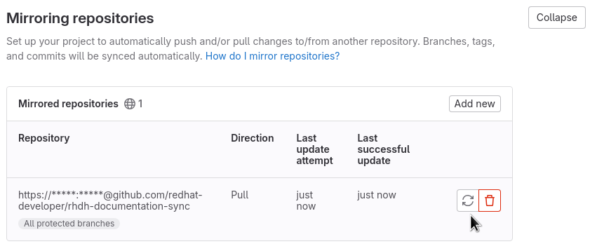

# Syncing between GitHub and GitLab

## Upstream

The upstream repo for contributions to the *Red Hat Developer Hub product documentation* is:

* https://github.com/redhat-developer/red-hat-developers-documentation-rhdh

## Downstream

The downstream repo (with pantheon integration) is:

https://gitlab.cee.redhat.com/red-hat-developers-documentation/rhdh

Please make changes to the GitHub repo. Changes made to GitLab will be overwritten.

## Sync configuration

Sync is set up for any and all https://github.com/redhat-developer/red-hat-developers-documentation-rhdh/settings/branches[PROTECTED branches] in the upstream GitHub repo.

### Repo mirror configuration

Should you meed to recreate the mirror setup, here are the steps:

1. delete and create a new mirror rule from the `Mirroring repositories` section under  https://gitlab.cee.redhat.com/red-hat-developers-documentation/rhdh/-/settings/repository[Settings > Repository].

* use the format https://bot-user@github.com/redhat-developer/rhdh-documentation-sync.git (NOTE: use the *original* repo name for redhat-developer/red-hat-developers-documentation-rhdh or sync will fail)

* for the password, use the bot-user's PAT (see gitlab repo rhidp/productization/secrets for the latest or to create a new one when the current one expires)

* select the option to only mirror https://github.com/redhat-developer/red-hat-developers-documentation-rhdh/settings/branches[PROTECTED branches] from the upstream repo

2. apply new Personal Access Token under https://gitlab.cee.redhat.com/red-hat-developers-documentation/rhdh/-/settings/integrations/github/edit[Settings > Integrations > Github].

3. You can manually trigger a sync from the `Mirroring repositories` section under  https://gitlab.cee.redhat.com/red-hat-developers-documentation/rhdh/-/settings/repository[Settings > Repository].

